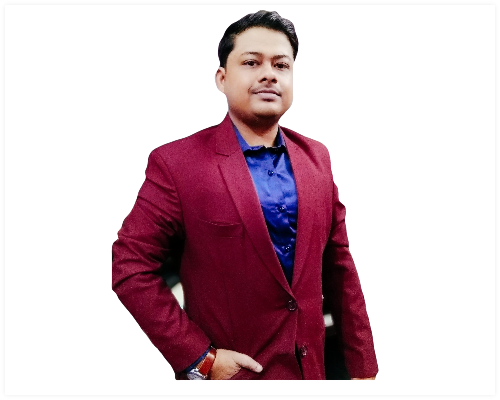

## About Me
---

  

Hi!  I’m **Abhisek Chowdhury**     A Project Officer (IT) at National Digital Library (NDL) , IIT Kharagpur.

    

## Research Interest

---

I work in the field of **'Disaster Management specifically Flood using Social Media'** where analysing the Twitter texts is an important objective for sentiment analysis to filter out the real-world flood tweets using SVM and other classifiers and also location extraction from raw tweets using NLP technics is a real challenge since most of the tweets lacks the geo-tags in India. And finally identifying the flood affected regions in India (State of Bihar as a case study) from tweets and other auxiliary data sets (eg. Satellite data, rainfall, water-bodies etc) with a probabilistic unsupervised model developed using Restricted Boltzmann Machines (RBMs).

## Educational Qualifications 

---

#### 2013–2015
Master of Science (M.Sc.), Vidyasagar University (VU), Midnapore, West Bengal, India – 721102.
Subject– Computer Science, Marks – 82.70 %

#### 2010–2013 
Bachelor of Science (B.Sc.), Midnapore College, (Affl. to VU), Midnapore, West Bengal, India – 721101.
Subject– Computer Science (Hons), Marks – 76.90 %

#### 2010 
Higher Secondary Examination (10+2), Board W.B.C.H.S.E., School – Vidyasagar Vidyapith, Midnapore, West Bengal, India – 721101.
Stream – Science (Eng., Beng., Phys., Chem., Math.), Marks – 70.60 %

#### 2008 
Secondary (Madhyamik) Examination (10th Std.), Board W.B.B.S.E., School – Vidyasagar Vidyapith, Midnapore, West Bengal, India – 721101.
Subject– All (With Add’l Biology), Marks – 87.13 % 

## Awards and Accolades

---

| Year | Award      | Description                                                  |
| ---- | ---------- | ------------------------------------------------------------ |
| 2018 | UGC NET    | Qualified **UGC NET 2018 (July)** exam for Assistant Professorship. |
| 2018 | GATE       | Qualified **GATE 2018** exam in CS with score 465 and AIR 5444. |
| 2017 | WB SET     | Qualified **West Bengal SET 2017** exam securing 69.7 % marks. |
| 2016 | IBM Day    | Member of the Mobilitics group ranking 3rd on **IBM Day 2016** competition in Dept. of Computer Science & Engineering, IIT Kharagpur, India. |
| 2016 | INSPIRE    | Received **INSPIRE Fellowship** from DST, India to pursue Ph.D. |
| 2015 | Gold Medal | **Topper (Gold Medalist)** in M.Sc. Computer Science from Vidyasagar University. |
| 2013 | Gold Medal | **Topper (Gold Medalist)** in B.Sc. Computer Science from Vidyasagar University. |
| 2008 | Madhyamik  | Scored **100 out of 100** in Mathematics in Madhyamik Examination. |

## Work Experiences

---

#### 2018 – Present 
Project Officer (IT), Indian Institute of Technology Kharagpur, India.
Project – National Digital Library of India, MHRD, India

#### 2016 – 2018 
Junior Project Officer, Indian Institute of Technology Kharagpur, India.
Project – Design and Development of IIT Kharagpur Institute Website

#### 2015 – 2016 
Software Developer, Indian Institute of Technology Kharagpur, India.
Dept. – Institute Information Cell 

## Publications

---

1. Shreya Ghosh, **Abhisek Chowdhury**, and Soumya K. Ghosh. “A Machine Learning Approach to Find the Optimal Routes through Analysis of GPS Traces of Mobile City Traffic” ICACNI 2017. [pdf](/paper/icacni2017.pdf)

## Technical Skills 

---

#### Languages
C, C++, JAVA, Python, PHP, Prolog, Unix Shell, 8085 µP
Databases Oracle, PostgreSQL, MySQL, MS SQL Server, SQLite DB, PostGIS

#### Development
JAVA Spring Framework, Android, ASP.NET, PHP, JSP, Bootstrap, Javascript, AJAX, JQuery, REST API, JSON, XML

#### Tools
Android Studio, Eclipse, NetBeans, Visual Studio, Dreamweaver, IIS , WAMP, Apache Tomcat, Git 

## Fields of Special Interest 

---

* Machine Learning 
* Data Mining 
* NLP 
* Cloud Computing
* Complex Network 

## Academic Projects 

---

#### Jan 2015 – May 2015
Data Mining, RFID Technology and a Mobile Based Information System for Improvement of Safety & Security of School Trips.  M.Sc. Final Semester Project, Vidyasagar University, Midnapore, [ppt](https://goo.gl/3a3mN9).  Supervisor: Prof. Tanmoy Chakraborty, Dept. of Computer Science, Vidyasagar University, West Bengal, India

#### Mar 2014 – May 2014
ClickCart.com  M.Sc. 2nd Semester Project, Vidyasagar University, Midnapore. ClickCart.com is an e-commerce web platform implemented using ASP.NET technology in Microsoft Visual Studio,  VB.NET language, ADO.NET database technology and IIS 7.0 server.

#### Dec 2012 – Apr 2013
EstateEncase.com  B.Sc. Final Year Project, Midnapore College, Midnapore. EstateEncase.com is a real estate management website implemented using ASP.NET technology in Microsoft Visual Studio, VB.NET language, ADO.NET database technology and IIS 7.0 server. 

## Freelancing Works 

---

#### Aug 2017 – Nov 2017
Daily Tracker, Daily routine tracking system using smartphone tri-axial accelerometer IIT Kharagpur, India, [[ppt]](https://goo.gl/bNejj3).

#### July 2017 – Sept 2017
GeoCloud, Spatial Data Science Lab, IIT Kharagpur, India. Deployment of a small scale cloud setup using Mirantis Openstack 9.0 with 1 Fuel, 1 Controller, 2 Compute and 1 Storage node. Supervisor – Prof. Soumya Kanti Ghosh, 
Dept. of Computer Science and Engineering, IIT Kharagpur, India

#### Aug 2016 – Nov 2016
Detecting Traffic Congestion and Anomalous Road Events of Road Networks, IIT Kharagpur, India, [[github]](https://github.com/cs60050/MacTrackz)

#### Mar 2016 
Mobilytics, Mobility Summary and User Categorization based on Semantic Analysis of Human Movement Patterns , IIT Kharagpur, India, [[ppt]](https://goo.gl/5yQE8C). Development using Python, Bootstrap framework, JS, JSP, Servlet, Google Map API, Android Materials Library, JSON. Supervisor – Prof. Soumya Kanti Ghosh, 
Dept. of Computer Science and Engineering, IIT Kharagpur, India

#### Jan 2016 – Feb 2016
Android API for Visualization & Data Access from WMS GIS Lab, IIT Kharagpur, India, [[ppt]](https://goo.gl/z1BR99).
Idea – Assist android developers by providing a useful set of tools for easy data access & visualization of WMS in the target android application. Supervisor – Prof. Soumya Kanti Ghosh, 
Dept. of Computer Science and Engineering, IIT Kharagpur, India

#### Dec 2015 
Feedback System for IIT Kharagpur Website Institute Information Cell, IIT Kharagpur, India. Developed using JSP, Servlet, CSS, JS, JQuery, AJAX, PostgreSQL. Supervisor – Prof. Soumya Kanti Ghosh & Prof. Pralay Mitra, Dept. of Computer Science and Engineering, IIT Kharagpur, India

## Communication Skills 

---

* Bengali	- Mother tongue (Read, Written & Spoken)
* English	- Good (Read, Written & Spoken)
* Hindi	- Moderate (Read & Spoken )

## Hobbies

---

* Latest Technologies 
* Video Games
* Photography 

## Personal Details 

---

#### Address 
Rabindranagar, Midnapore Town, Paschim Medinipur, West Bengal, India – 721101

#### Contact 
* Mobile – [+91-9434229961](tel:+91-9434229961) , [+91-9046109298](tel:+91-9434229961)
* Email  – [abhisekchowdhury9@gmail.com](mailto:abhisekchowdhury9@gmail.com) , [abhisek.chowdhury@iitkgp.ac.in](mailto:abhisek.chowdhury@iitkgp.ac.in)
* Date of Birth – 13th June, 1992 
* Gender – Male
* Nationality – Indian 
* Religion – Hinduism
* Caste – General

## References

---

* Arindam Dasgupta , PhD Scholar, IIT Kharagpur 
  * adgkgp@gmail.com

